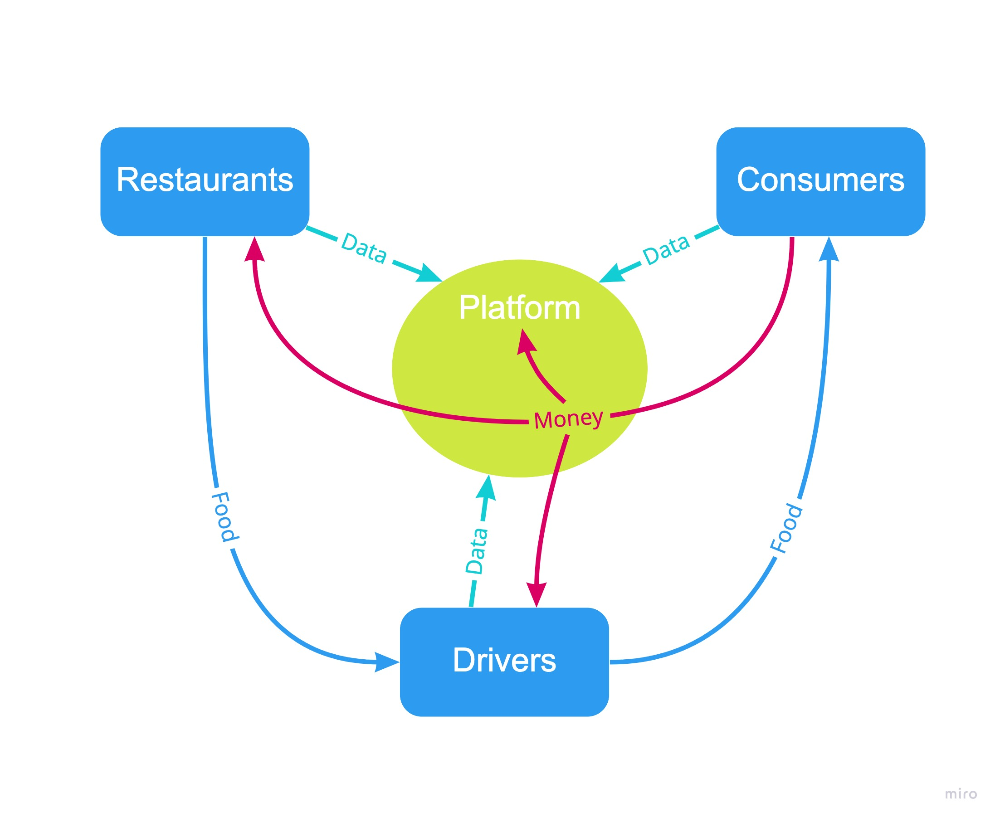
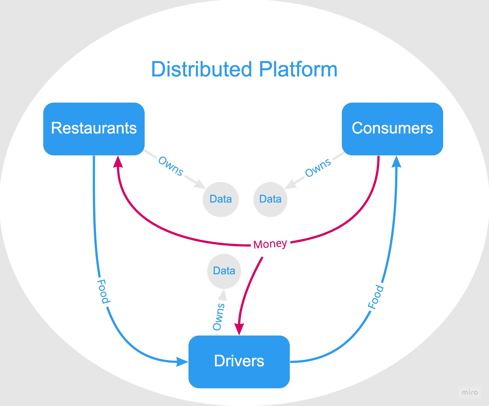

## Introduction

### Background on Online Food Ordering

The most prominent food ordering business model is through an online 3rd party platform which aggregates restaurants, consumers, and drivers such as Uber Eats and DoorDash. As illustrated in the following diagram, the food delivery platform processes food orders from the consumers and coordinates the restaurants and drivers to prepare and deliver the food to them.

 

- Food ordering platforms often charge an upfront payment and a per order commission fee (5% - 30%), which covers the cost of customer marketing for restaurants, and the coordination of food delivery between the restaurants, drivers, and customers.

- Food delivery platforms collect data (both transactional and personal data) from all the participants

### The problems with third-party platforms are:

1. The platform's incentives are not aligned with its participants. As a result, the platform tends to exploit and extract (monetary / informational) value from its participants for the interest of company shareholders.

2. There is a lack of transparency and information sharing for platform participants (both transactional and personal data). As a result, restaurants lose direct control and communication with their customers and become increasingly dependent on the decisions of 3rd party platforms. 

### The Solution

A decentralized food ordering platform owned by the participants (restaurants and customers) where incentives are aligned, that is, the value created by the participants is redistributed back to them instead of a middle man, viz. a centralized platform. By leveraging the blockchain technology, all the participants of the platform can participate in the governance of the platform effectively and efficiently. The blockchain technology can also provide unprecedented data transparency and security, which leaves each individual participant's data in their sole discretion.

